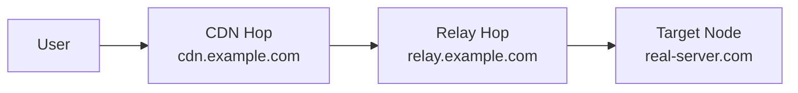

# Ağ Politikası

!!! abstract "Yönlendirme ve Giden Bağlantılar"
    Trafiğin düğümlerinizden nasıl çıkacağını kontrol edin — doğrudan, engelli, diğer proxy'ler üzerinden zincirleme veya Cloudflare WARP üzerinden. Yeniden kullanılabilir yönlendirme paketleri ve çoklu atlama aktarma zincirleri oluşturun.

---

## Giden Bağlantılar

**Ağ → Giden Bağlantılar**

Bir giden bağlantı, trafiğin bir düğümün gelen bağlantısına girdikten sonra nereye gittiğini tanımlar.

| Tür | Açıklama |
|-----|----------|
| **Freedom** | Doğrudan internet erişimi (varsayılan) |
| **Blackhole** | Trafiği sessizce düşür |
| **DNS** | Belirtilen DNS sunucusu üzerinden çöz |
| **Proxy zinciri** | Başka bir proxy'ye ilet (SOCKS/HTTP/Trojan/VMess/VLESS) |
| **WARP+** | Temiz IP için Cloudflare WARP üzerinden yönlendir |

### WARP+ Entegrasyonu

1. **Ağ → Giden Bağlantılar → Ekle → WARP+** bölümüne gidin
2. WARP lisans anahtarınızı girin (veya ücretsiz katmanı kullanın)
3. Panel, Cloudflare'ın kenarına WireGuard yapılandırır
4. Belirli alan adları/IP'ler için yönlendirme kurallarına bu giden bağlantıyı atayın

!!! tip
    WARP+, düğüm IP'niz Google, ChatGPT veya yayın siteleri tarafından işaretlendiğinde kullanışlıdır. Temiz IP için bu alan adlarını WARP üzerinden yönlendirin.

---

## Yönlendirme Kuralları

**Ağ → Yönlendirme**

Kurallar, eşleştiricilere göre hangi giden bağlantının her bağlantıyı yönettiğini belirler:

| Eşleştirici | Açıklama |
|-------------|----------|
| Alan adı | Tam alan adı, alt alan adı, anahtar kelime veya regex |
| IP | CIDR aralığı veya GeoIP ülkesi |
| Port | Hedef port veya aralık |
| Protokol | HTTP, TLS, BitTorrent, vb. |
| Gelen bağlantı etiketi | Belirli gelen bağlantıyı eşleştir |
| Kaynak IP | İstemci kaynak IP/CIDR |
| Kullanıcı | Belirli kullanıcı adını eşleştir |

Kurallar öncelik sırasına göre değerlendirilir. İlk eşleşen kazanır.

---

## Akıllı Yönlendirme Kural Paketleri

**Ağ → Yönlendirme Paketleri**

Bir **yönlendirme paketi**, yeniden kullanılabilir, isimlendirilmiş yönlendirme kuralları koleksiyonudur. Bir kez oluşturun, her yerde uygulayın.

### Eylemler

| Eylem | Açıklama |
|-------|----------|
| Oluştur/düzenle | Sıralı yönlendirme kurallarından bir paket oluşturun |
| Düğüme uygula | Düğümün yönlendirmesini paketle değiştir ve yeniden senkronize et |
| Global varsayılan olarak ayarla | Geçersiz kılınmadıkça filo genelinde tek paket uygulanır |
| Kullanıcıya ata | Kullanıcının aboneliğine belirli bir paket yerleştir |

### Dahili Paketler

VortexUI yaygın paketlerle gelir:

- **Reklamları Engelle** — reklam alan adlarını engelle
- **İran Doğrudan** — İran alan adlarını/IP'lerini doğrudan yönlendir
- **Yayın Doğrudan** — yerel yayın hizmetleri için proxy'yi atla
- **Torrent Engelle** — BitTorrent protokolünü engelle

### Özel Paket Oluşturma

1. **Yeni Paket**'e tıklayın → bir ad girin
2. Öncelik sırasına göre kurallar ekleyin (düğüm yönlendirmesi ile aynı alanlar)
3. Kaydedin, ardından:
    - Canlı olarak göndermek için bir düğüme **Uygula**
    - Filo için **Varsayılan** olarak işaretleyin
    - Kullanıcı detay sayfasından bir kullanıcıya **Ata**

!!! note
    Kullanıcı bazında atama global varsayılandan önceliklidir. Ataması olmayan kullanıcı varsayılan pakete döner.

---

## CDN/Aktarma Zinciri Oluşturucu

**Ağ → CDN/Aktarma Zincirleri**

Gerçek sunucu IP'nizi ara atlamalar üzerinden trafik yönlendirerek gizleyin.

### Atlama Türleri

| Tür | Açıklama | En iyi kullanım |
|-----|----------|-----------------|
| **CDN** | Cloudflare/CDN üzerinden trafik | Ücretsiz IP gizleme, WS taşıması gerektirir |
| **Aktarma** | Bir VPS aktarması üzerinden trafik | CDN engellendiğinde veya TCP gerektiğinde |
| **Worker** | Aktarma olarak Cloudflare Workers | Sunucusuz, maliyet-etkin |

### Zincir Oluşturma

1. **Yeni Zincir**'e tıklayın
2. Adlandırın ve hedef düğümü seçin
3. Sıralı atlamalar ekleyin (Kullanıcı → Atlama 1 → Atlama 2 → Düğüm)
4. Her atlamayı yapılandırın:
    - Tür (CDN / Aktarma / Worker)
    - Adres ve port
    - Protokol (WebSocket / gRPC / TCP)
    - SNI ve yol (TLS taşımaları için)



!!! example "Cloudflare CDN Zinciri"
    ```
    Atlama 1: CDN — cdn.example.com:443 — WebSocket — SNI: cdn.example.com — Yol: /ws
    Hedef: Gerçek düğümünüz
    ```
    Kullanıcılar Cloudflare'a bağlanır → Cloudflare düğümünüze yönlendirir. Gerçek IP gizli.

---

## Yük Dengeleyiciler

**Ağ → Yük Dengeleyiciler**

Sağlık kontrolü ile trafiği birden fazla giden bağlantıya dağıtın.

### Stratejiler

| Strateji | Davranış |
|----------|----------|
| **Round-robin** | Sağlıklı hedefler arasında eşit dağıtım |
| **Rastgele** | Bağlantı başına rastgele seçim |
| **En az bağlantı** | En az aktif bağlantıya sahip hedefe yönlendir |
| **En düşük gecikme** | En düşük ölçülen gecikmeye sahip hedefe yönlendir |

### Sağlık Problaması

| Ayar | Açıklama |
|------|----------|
| Aralık | Sağlık kontrolleri arası saniye |
| Zaman aşımı | Prob yanıtı için maksimum bekleme |
| Sağlıksız sonra | Çökmüş olarak işaretlemek için ardışık başarısızlıklar |
| Sağlıklı sonra | Ayakta olarak işaretlemek için ardışık başarılar |

Sağlıksız hedefler otomatik olarak rotasyondan çıkarılır ve düzeldiklerinde geri alınır.

---

## Çoklu Alan Adı SNI Yönlendirme + Otomatik SSL

**Ağ → SNI Yönlendirme**

Otomatik yönlendirme ve SSL ile tek bir port üzerinde birden fazla alan adı barındırın:

1. **Alan Adı Ekle** — alan adı ve hedef gelen bağlantıyı girin
2. Otomatik Let's Encrypt sertifikaları için **Otomatik SSL sağla**'yı etkinleştirin
3. Trafik TLS SNI alanına göre yönlendirilir

Özellikler:

- Joker sertifikalar (`*.domain.com`)
- Sona ermeden önce otomatik yenileme
- Düğüm başına birden fazla alan adı
- SNI ayrımı ile aynı portta karışık REALITY + TLS

---

## GeoIP/Geosite Güncelleyici

**Ağ → GeoIP/Geosite**

Yönlendirme kuralları tarafından kullanılan coğrafi konum veritabanlarını yönetin:

- **Otomatik güncelleme** — bir programa göre yeni sürümleri kontrol et
- **Manuel güncelleme** — en son sürümü hemen indir
- **Özel kaynaklar** — kendi dat/db dosyalarınıza yönlendirin
- Hem `geoip.dat`/`geosite.dat` (V2Ray) hem de `geoip.db`/`geosite.db` (sing-box) destekler

---

## Panel Federasyonu

**Ağ → Federasyon**

Dağıtık yönetim için birden fazla VortexUI panelini bağlayın.

### Kullanım Senaryoları

- Farklı bölgelerde panelleri olan büyük dağıtımlar
- Her bayinin kendi paneli olduğu bayi kurulumları
- Yüksek erişilebilirlik — bir panel çökerse diğerleri devam eder

### Yapılandırma

| Ayar | Açıklama |
|------|----------|
| Etkin | Federasyonu etkinleştir |
| Küme adı | Bu kümenin tanımlayıcısı |
| Senkronizasyon aralığı | Ne sıklıkla senkronize edileceği (saniye) |
| SSO | Paneller arası tek oturum açma etkinleştir |

### Eş Ekleme

1. **Eş Ekle**'ye tıklayın
2. Eş panel URL'sini girin
3. API anahtarını girin (eş panelde oluşturulur)
4. Senkronizasyon kapsamını seçin: Kullanıcılar, Düğümler veya her ikisi
5. Bağlantıyı test edin → Kaydet

### Senkronizasyon Olayları

Eşler arasındaki senkronizasyon geçmişini görüntüleyin — zaman damgaları, yön, senkronize edilen öğeler ve çakışmalar.
