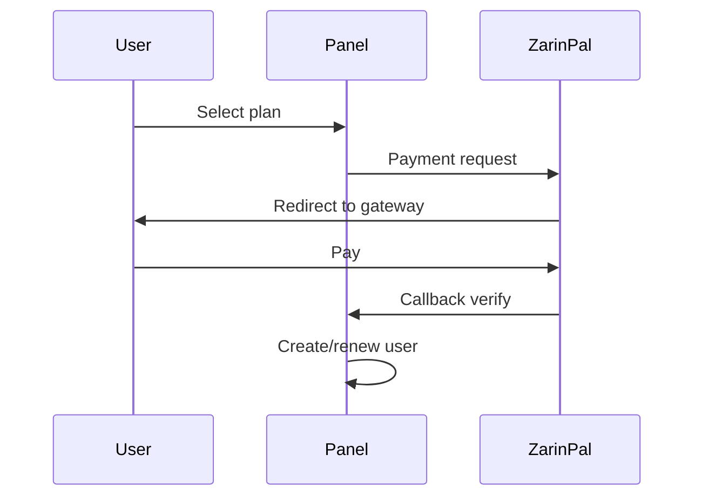

<div align="center">


**VortexUI Wiki**

[Wiki](./README.md) · [FA](../fa/09-plans-payments.md) · [EN](../en/09-plans-payments.md) · [AR](../ar/09-plans-payments.md)

</div>

<div>

# 9. Planlar ve Ödemeler

[← Güvenlik](./08-security-administration.md) · [Dizin](./README.md) · [Sonraki: Bildirimler →](./10-notifications.md)

> [!NOTE]
> Başarılı ödemeden sonra kullanıcı plan parametreleriyle otomatik oluşturulur/yenilenir.

---

## Plan Sistemi

**Plans → New Plan**

| Alan | Açıklama |
|-------|-------------|
| Name | Plan adı (ör. "Monthly 50GB") |
| Data limit | Trafik limiti |
| Duration days | Abonelik süresi |
| Device limit | Cihaz sayısı |
| Reset strategy | monthly / … |
| Price (Toman) | Rial fiyatı |
| Price (USD) | Dolar/kripto fiyatı |
| Max users | Satış limiti (0 = sınırsız) |
| Enabled | Aktif/pasif |

---

## Siparişler

**Orders** — sipariş listesi:

| Durum | Anlam |
|--------|---------|
| `pending` | Ödeme bekleniyor |
| `paid` | Ödendi — kullanıcı oluşturuldu/yenilendi |
| `failed` | Başarısız |
| `expired` | Zaman aşımı |

---

## ZarinPal Ağ Geçidi (Rial)

### Yapılandırma

`deploy/.env` içinde ZarinPal ile ilgili env değişkenlerini ayarlayın (Merchant ID ve callback URL).

### Ödeme akışı



---

## NowPayments Ağ Geçidi (Kripto)

### IPN Webhook

```
POST /api/payment/ipn/nowpayments
```

- `NowPaymentsIPNSecret` ile HMAC-SHA512 imzası
- Doğrulama sonrası → otomatik aktivasyon

---

## Otomatik Satış

1. Aktif plan oluştur
2. Genel satış bağlantısı (UI/API'de)
3. Başarılı ödeme sonrası → plan parametreleriyle kullanıcı

---

## Bayi + Planlar

Bayi kotası dahilinde plan satabilir — kullanıcılar kendi `admin_id`'si altında kaydedilir.

</div>
