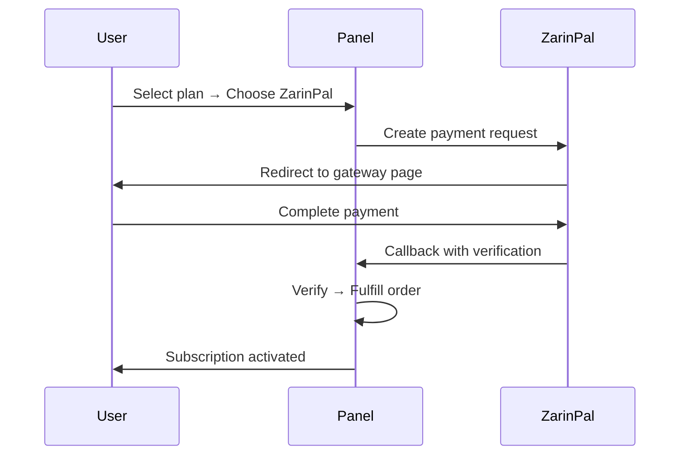
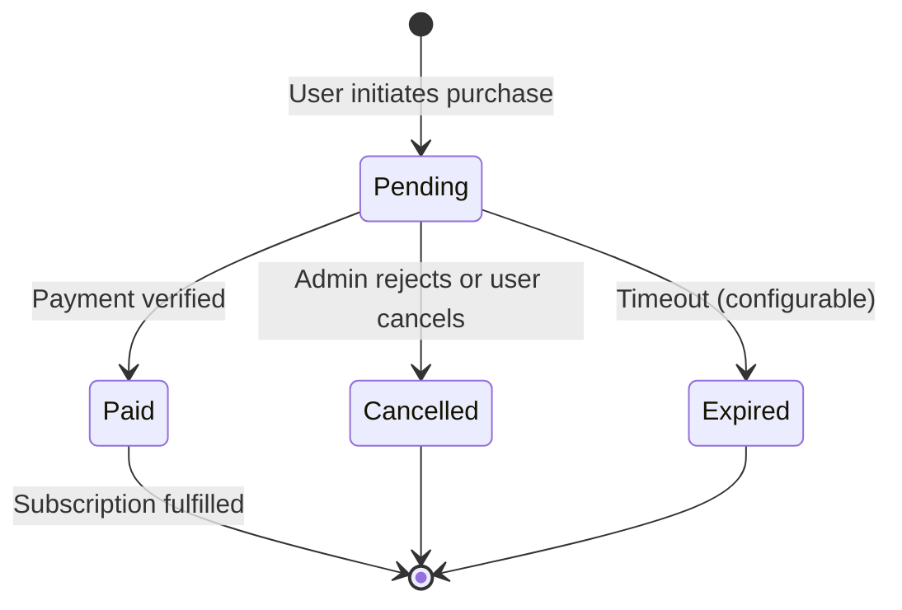

# Planlar ve Ödemeler

!!! abstract "Bayi Bazlı Ticaret"
    Her yönetici/bayi kendi planlarını oluşturur, kendi ödeme yöntemlerini yapılandırır ve kendi siparişlerini yönetir. Son kullanıcılar bayilerine özgü bir self-servis mağazadan satın alır.

---

## Plan Sistemi

Planlar **oluşturan yöneticiye aittir**. Her bayi kendi kataloğunu bağımsız olarak yönetir.

### Plan Oluşturma

**Planlar → Yeni Plan**

| Alan | Açıklama |
|------|----------|
| Ad | Görüntü adı (örn. "Aylık 50GB") |
| Veri limiti | Trafik sınırı (bayt) |
| Süre (gün) | Abonelik süresi |
| Cihaz limiti | Maksimum eş zamanlı cihaz |
| Sıfırlama stratejisi | `none` / `daily` / `weekly` / `monthly` |
| Fiyat (Toman) | ZarinPal/kart ödemeleri için IRR fiyatı |
| Fiyat (USD) | Kripto ödemeleri için dolar fiyatı |
| Maks. kullanıcı | Satış sınırı (`0` = sınırsız) |
| Etkin | Aktif/pasif geçişi |

### Plan Görünürlüğü

| Yönetici Türü | Gördüğü |
|---------------|---------|
| Sudo yönetici | Tüm yöneticilerden tüm planlar |
| Bayi | Yalnızca kendi planları |
| Son kullanıcı (mağazada) | Yalnızca bayisinin etkin planları |

### Plan Sahipliği

- **Sudo yönetici** global planlar oluşturur (bayisi olmayan tüm kullanıcılara görünür)
- **Bayi** yalnızca kendi kullanıcıları için planlar oluşturur
- Mağazayı ziyaret eden kullanıcı, hesabını yöneten yöneticinin planlarını görür

---

## Ödeme Yapılandırması

Her yönetici/bayi kendi ödeme yöntemlerini bağımsız olarak yapılandırır.

**Ayarlar → Ödeme Yapılandırması** (veya **Bayi Hesabı → Ödeme**)

### Mevcut Yöntemler

| Yöntem | Tür | Yapılandırma |
|--------|-----|-------------|
| **ZarinPal** | Çevrimiçi geçit | Satıcı ID |
| **Karttan karta** | Manuel dekont | Kart numarası + kart sahibi adı |
| **Kripto** | Manuel dekont | Cüzdan adresleri (BTC, USDT, ETH, vb.) |

### Bayi Bazlı Ödeme Yapılandırması

Her bayi kendi ödeme detaylarını ayarlar:

```
Bayi A → ZarinPal satıcı: xxxx + Kart: 6219-xxxx-xxxx-1234
Bayi B → Yalnızca kripto: USDT TRC20 adresi
Bayi C → Karttan karta: 6037-xxxx-xxxx-5678
```

Her bayinin mağazasındaki kullanıcılar yalnızca o bayinin yapılandırdığı ödeme seçeneklerini görür.

---

## Ödeme Yöntemleri

### ZarinPal (Çevrimiçi Geçit)

Otomatik akış — yönetici müdahalesi gerekmez:



Yapılandırma: `VORTEX_ZARINPAL_MERCHANT` ayarlayın (veya ödeme yapılandırmasında bayi bazlı satıcı ID).

### Karttan Karta (Dekont Yükleme)

Manuel doğrulama akışı:

1. Kullanıcı plan seçer → "Karttan Karta" seçer
2. Panel bayinin kart numarasını ve kart sahibi adını gösterir
3. Kullanıcı bankacılık uygulaması ile parayı transfer eder
4. Kullanıcı **dekont görüntüsü** + isteğe bağlı **referans numarası** yükler
5. Sipariş durumu: `pending`
6. Yönetici/bayi dekont görüntüsünü inceler → **Onayla** veya **Reddet**
7. Onaylandığında → abonelik etkinleştirilir

!!! info
    Dekont görüntüleri güvenli bir şekilde saklanır ve yalnızca yöneten yönetici tarafından erişilebilir.

### Kripto (TX Hash + Ekran Görüntüsü)

Manuel doğrulama akışı:

1. Kullanıcı plan seçer → "Kripto" seçer
2. Panel bayinin cüzdan adreslerini gösterir
3. Kullanıcı kripto gönderir ve şunları sağlar:
    - **İşlem hash'i** (zorunlu)
    - **İşlem ekran görüntüsü** (isteğe bağlı)
4. Sipariş durumu: `pending`
5. Yönetici/bayi TX hash'i zincir üzerinde doğrular → **Onayla** veya **Reddet**
6. Onaylandığında → abonelik etkinleştirilir

---

## Self-Servis Mağaza

**URL:** `/sub/{token}/shop`

Mağaza, kullanıcı portalının bir parçasıdır ve abonelik tokeni ile erişilebilir.

### Kullanıcı Deneyimi

1. Kullanıcı abonelik tokeni ile portala giriş yapar
2. **Planlar** sekmesine gider
3. Yöneten yöneticisi/bayisi tarafından oluşturulan planları görür
4. Plan seçer → ödeme yöntemini seçer
5. Ödemeyi tamamlar (veya dekont yükler)
6. Tamamlanmayı bekler

### React Portal Satın Alma Akışı (PortalPlans)

Portal şunları gösterir:

- Ad, veri limiti, süre, fiyat ile plan kartları
- Ödeme yöntemi seçici (yalnızca bayinin yapılandırdığı yöntemler)
- Yükleme formu (karttan karta / kripto dekontlar için)
- Sipariş durumu izleyici

---

## Sipariş Yaşam Döngüsü



| Durum | Anlamı |
|-------|--------|
| `pending` | Ödeme veya dekont incelemesi bekleniyor |
| `paid` | Ödeme onaylandı — abonelik etkinleştirildi |
| `cancelled` | Yönetici tarafından reddedildi veya kullanıcı tarafından iptal edildi |
| `expired` | Ödeme zaman aşımı süresi doldu |

---

## Bekleyen Sipariş İnceleme

**Siparişler → Bekleyen** (yönetici/bayi görünümü)

Karttan karta ve kripto siparişleri için:

1. Sipariş detaylarını görüntüleyin: kullanıcı, plan, tutar, zaman damgası
2. Yüklenen **dekont görüntüsünü** (makbuz/ekran görüntüsü) görüntüleyin
3. **Referans numarasını** veya **TX hash'i** görüntüleyin
4. Eylemler:
    - **Onayla** → siparişi tamamlar, aboneliği etkinleştirir
    - **Reddet** → siparişi iptal eder, kullanıcıyı neden ile bilgilendirir

!!! tip
    Dekont yüklemelerini kaçırmamak için yeni bekleyen siparişler hakkında Telegram bildirimlerini etkinleştirin.

---

## Bayi Cüzdan Faturalandırma

Doğrudan kullanıcılara satmayan ama kapasite için yöneticiye ödeme yapan bayiler için.

### Nasıl Çalışır

| Kredi Türü | Ne Zaman Düşülür |
|------------|------------------|
| Trafik kredileri (GB) | Kullanıcılar veri tüketir (tüketilen mod) veya bayi limit atar (atanmış mod) |
| Kullanıcı kredileri (adet) | Bayi yeni kullanıcı oluşturur |

### Cüzdan İşlemleri

| Eylem | Kim | Açıklama |
|-------|-----|----------|
| Bakiye görüntüle | Bayi | Kalan trafik + kullanıcı kredilerini gör |
| Defter görüntüle | Bayi | Tüm değişikliklerin tam geçmişi |
| Yükleme talep et | Bayi | Sudo yöneticiye yükleme talebi gönder |
| Yükleme onayla | Sudo | İnceleyip yatırımı onayla |
| Hızlı ayarlama | Sudo | +50 hesap / +10 GB / +50 GB butonları |

### Cüzdan Yatırım Onay Kuyruğu

**Yöneticiler → Cüzdan Yatırımları** (sudo görünümü)

1. Bayi yükleme talebi gönderir (tutar + ödeme kanıtı)
2. Talep onay kuyruğunda görünür
3. Sudo yönetici inceler → **Onayla** (krediler eklenir) veya **Reddet**

---

## Tamamlama Mantığı

Bir sipariş `paid` olarak işaretlendiğinde:

1. **Kullanıcı mevcutsa** — aboneliği uzat:
    - Trafik: mevcut kalan + planın veri limiti (toplamalı)
    - Süre: mevcut bitiş + planın süre günleri (toplamalı)
    - Cihaz limiti: planın değerine güncellenir
    - Trafik sıfırlaması yok — mevcut kalan veri korunur

2. **Kullanıcı yeniyse** — plan parametreleriyle hesap oluştur

!!! info "Toplamalı Yığınlama"
    Birden fazla satın alma toplamalı olarak yığınlanır. 50GB'lık bir planı iki kez satın almak toplam 100GB verir.
    Süre de yığınlanır — iki 30 günlük plan satın almak mevcut bitiş tarihinden 60 gün uzatır.

---

## Kota Modu Özeti

| Mod | Havuz ne zaman azalır | En uygun kullanım |
|-----|----------------------|-------------------|
| **Atanmış** | Bayi kullanıcılara veri limiti atadığında | Önceden satılmış sabit paketler |
| **Tüketilen** | Kullanıcılar gerçekten trafik kullandığında | Kullanım başına faturalandırma |

**Yöneticiler → Yönetici düzenle → Trafik kota modu** bölümünde bayi başına yapılandırın.
