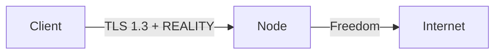

# Protokoller ve Yapılandırma

!!! info "Yetenek Matrisi"
    Panel, tek doğruluk kaynağı olarak canlı bir protokol başına yetenek matrisi sunar (`GET /api/capabilities`). Gelen bağlantı düzenleyicisi yalnızca seçilen düğümün çekirdeğinin gerçekten desteklediği kombinasyonları sunar.

---

## Protokol Genel Bakışı

| Protokol | Çekirdek | Gelen | Giden | Taşıma | Güvenlik |
|----------|----------|:-----:|:-----:|--------|----------|
| VLESS | Her ikisi | ✅ | ✅ | TCP, WS, gRPC, HTTPUpgrade, xHTTP, mKCP | None, TLS, REALITY |
| VMess | Her ikisi | ✅ | ✅ | TCP, WS, gRPC, HTTPUpgrade, mKCP | None, TLS |
| Trojan | Her ikisi | ✅ | ✅ | TCP, WS, gRPC, mKCP | TLS, REALITY |
| Shadowsocks | Her ikisi | ✅ | ✅ | TCP (+ SS-2022 çoklu kullanıcı) | None |
| Hysteria2 | sing-box | ✅ | ✅ | UDP (QUIC) | TLS |
| TUIC | sing-box | ✅ | ✅ | UDP (QUIC) | TLS |
| WireGuard | sing-box | ✅ | ✅ | UDP | Yerel |
| Hysteria (v1) | sing-box | ✅ | — | UDP | TLS |
| ShadowTLS | sing-box | ✅ | ✅ | TCP | TLS |
| AnyTLS | sing-box | ✅ | — | TCP | TLS |
| Naive | sing-box | ✅ | — | — | TLS (zorunlu) |
| SOCKS | Her ikisi | ✅ | ✅ | — (ham TCP) | düz metin |
| HTTP | Her ikisi | ✅ | ✅ | — (ham TCP) | düz metin |
| Dokodemo | Xray | ✅ | — | — (ham TCP/UDP) | düz metin |

---

## Protokol Bazında Yapılandırma

### VLESS + REALITY (Önerilen)

Sansür dayanıklılığı için altın standart. REALITY, TLS sertifikası ihtiyacını ortadan kaldırır.

**Gelen bağlantı yapılandırması:**

| Alan | Örnek |
|------|-------|
| Protokol | `vless` |
| Port | `443` |
| Taşıma | `tcp` |
| Güvenlik | `reality` |
| Hedef (target) | `www.google.com:443` |
| Sunucu Adları | `www.google.com` |
| Özel Anahtar | Otomatik oluşturulur |
| Kısa ID'ler | Otomatik oluşturulur (8'e kadar) |
| Akış | `xtls-rprx-vision` (TCP için) |

!!! tip
    Sunucu konumunuz için en iyi SNI alan adlarını bulmak üzere **Reality Tarayıcı**'yı kullanın.

### VMess + WebSocket + TLS

CDN fronting (Cloudflare) ile uyumlu klasik kurulum:

| Alan | Örnek |
|------|-------|
| Protokol | `vmess` |
| Port | `443` |
| Taşıma | `ws` |
| Yol | `/vmws` |
| Güvenlik | `tls` |
| SNI | `cdn.example.com` |

Alan adında WebSocket etkinken Cloudflare arkasında çalışır.

### Trojan + gRPC + TLS

Çoğullama ile yüksek performanslı seçenek:

| Alan | Örnek |
|------|-------|
| Protokol | `trojan` |
| Port | `443` |
| Taşıma | `grpc` |
| Servis Adı | `trojangrpc` |
| Güvenlik | `tls` |
| SNI | `your-domain.com` |

### Shadowsocks 2022 (Çoklu Kullanıcı)

Kullanıcı başına anahtarlarla modern Shadowsocks:

| Alan | Örnek |
|------|-------|
| Protokol | `shadowsocks` |
| Port | `8388` |
| Yöntem | `2022-blake3-aes-128-gcm` |
| Sunucu Anahtarı | Otomatik oluşturulur |
| Güvenlik | `none` (SS kendi şifrelemesini yönetir) |

Her kullanıcı türetilmiş bir anahtar alır — paylaşılan şifre yok.

### Hysteria2

Dahili tıkanıklık kontrolü ile QUIC tabanlı protokol. Kayıplı ağlar için mükemmel:

| Alan | Örnek |
|------|-------|
| Protokol | `hysteria2` |
| Port | `4443` |
| Güvenlik | `tls` (zorunlu) |
| Yukarı/Aşağı bant genişliği | Tıkanıklık kontrolü için istemci tarafından raporlanan |
| Obfs türü | `salamander` (isteğe bağlı) |
| Obfs şifresi | Paylaşılan gizli anahtar |

!!! note
    Hysteria2, sing-box çekirdeği gerektirir. Xray düğümlerinde mevcut değildir.

### TUIC

Sıfır-RTT ile QUIC tabanlı UDP aktarımı:

| Alan | Örnek |
|------|-------|
| Protokol | `tuic` |
| Port | `4444` |
| Güvenlik | `tls` (zorunlu) |
| Tıkanıklık | `bbr` veya `cubic` |
| UUID | Kullanıcı başına kimlik doğrulama |

### WireGuard

sing-box aracılığıyla yerel WireGuard tüneli:

| Alan | Örnek |
|------|-------|
| Protokol | `wireguard` |
| Port | `51820` |
| Özel Anahtar | Sunucu özel anahtarı |
| Eş genel anahtarları | Kullanıcı başına genel anahtarlar |
| İzin verilen IP'ler | `0.0.0.0/0, ::/0` |
| MTU | `1280` |

### Naive (NaiveProxy)

Normal HTTPS trafiği olarak gizlenmiş HTTP/2 veya HTTP/3 proxy:

| Alan | Örnek |
|------|-------|
| Protokol | `naive` |
| Port | `443` |
| Güvenlik | `tls` (zorunlu) |
| Kullanıcı adı/Şifre | Kullanıcı başına kimlik bilgileri |

!!! warning
    Naive, sing-box çekirdeği gerektirir ve **TLS zorunludur**. Geçerli bir sertifika olmadan çalışamaz.

### ShadowTLS

TLS kamuflajı — trafiğin popüler bir web sitesine normal bir TLS bağlantısı gibi görünmesini sağlar:

| Alan | Örnek |
|------|-------|
| Protokol | `shadowtls` |
| Port | `443` |
| Sürüm | `3` (önerilen) |
| Handshake sunucusu | `www.microsoft.com:443` |
| Şifre | Paylaşılan gizli anahtar |

---

## Yetenek Matrisi (Xray vs sing-box)

### Xray-core

| Kategori | Desteklenen |
|----------|-------------|
| Protokoller | vless, vmess, trojan, shadowsocks, socks, http, dokodemo |
| Taşımalar | tcp, ws, grpc, httpupgrade, http/h2, xhttp, mkcp |
| Güvenlik | none, tls, reality |
| Özel | xtls-rprx-vision akışı, xhttp mod seçici, mKCP başlıkları |

### sing-box

| Kategori | Desteklenen |
|----------|-------------|
| Protokoller | vless, vmess, trojan, shadowsocks, hysteria2, tuic, wireguard, hysteria, shadowtls, anytls, naive, socks, http |
| Taşımalar | tcp, ws, grpc, httpupgrade, http/h2, quic |
| Güvenlik | none, tls, reality (sınırlı) |
| Özel | QUIC tabanlı protokoller, çoğullama, brutal tıkanıklık |

### Akış Taşıması Olmayan Protokoller

| Protokol | Çekirdek | Taşıma | Güvenlik |
|----------|----------|--------|----------|
| SOCKS | Her ikisi | ham TCP | düz metin |
| HTTP | Her ikisi | ham TCP | düz metin |
| Naive | sing-box | — | TLS (zorunlu) |
| Dokodemo | Xray | ham TCP/UDP | düz metin |
| WireGuard | sing-box | UDP | yerel |
| Hysteria2 | sing-box | UDP (QUIC) | TLS |
| TUIC | sing-box | UDP (QUIC) | TLS |

!!! warning
    SOCKS ve HTTP gelen bağlantıları **düz metindir** — yalnızca güvenilir ağlarda veya yerel aktarma arkasında kullanın.

---

## Taşıma Detayları

### TCP

Varsayılan taşıma. İsteğe bağlı HTTP kamuflaj başlığını destekler (Xray).

### WebSocket (WS)

WebSocket'e HTTP yükseltme. CDN uyumlu (Cloudflare, vb.).

| Ayar | Açıklama |
|------|----------|
| Yol | URL yolu (örn. `/ws`) |
| Host | HTTP Host başlığı |
| Maks. erken veri | İlk WS çerçevesindeki baytlar (0-RTT) |

### gRPC

HTTP/2 tabanlı. Çoğullama ile yüksek performans.

| Ayar | Açıklama |
|------|----------|
| Servis adı | gRPC servis yolu |
| Çoklu mod | Çoklu akış modunu etkinleştir |

### HTTPUpgrade

HTTP/1.1 yükseltme (WS gibi ama daha basit). Her iki çekirdek tarafından desteklenir.

| Ayar | Açıklama |
|------|----------|
| Yol | URL yolu |
| Host | HTTP Host başlığı |

### xHTTP (yalnızca Xray)

Birden fazla moda sahip gelişmiş HTTP taşıması:

| Mod | Açıklama |
|-----|----------|
| `auto` | En iyi modu otomatik algıla |
| `packet-up` | Yükleme için paket çerçeveleme |
| `stream-up` | Akış yükleme |

### mKCP (yalnızca Xray)

FEC (İleri Hata Düzeltme) ile UDP tabanlı taşıma. Kayıplı ağlar için iyi.

| Ayar | Açıklama |
|------|----------|
| Başlık türü | `none`, `srtp`, `utp`, `wechat-video`, `dtls`, `wireguard` |
| Tohum | Gizleme tohumu |
| MTU | Maksimum iletim birimi |

### QUIC (yalnızca sing-box)

Hysteria/TUIC protokolleri için yerel QUIC taşıması.

---

## Güvenlik Katmanları

### None

Taşıma katmanında şifreleme yok. Protokol kendi şifrelemesini yönetir (örn. VMess, Shadowsocks).

### TLS

Standart TLS 1.2/1.3. Geçerli bir sertifika gerektirir (Caddy ile otomatik veya manuel yapılandırılmış).

| Ayar | Açıklama |
|------|----------|
| SNI | Sunucu adı göstergesi |
| ALPN | Uygulama katmanı protokolü (`h2`, `http/1.1`) |
| Sertifika | Otomatik (ACME) veya manuel (dosya yolu) |
| Min. sürüm | `1.2` veya `1.3` |
| Parmak izi | uTLS taklit |

### REALITY

Gerçek sertifikaya ihtiyaç duymadan TLS 1.3 taklidi. Sunucu meşru bir web sitesini taklit eder.

| Ayar | Açıklama |
|------|----------|
| Hedef | Taklit edilecek hedef sunucu |
| Sunucu Adları | İzin verilen SNI değerleri |
| Özel Anahtar | X25519 sunucu anahtarı |
| Kısa ID'ler | İstemci kimlik doğrulama ID'leri |
| Spider X | Aktif problama kaçınma yolu |

---

## Abonelik Çıktı Biçimleri

| Biçim | Content-Type | Açıklama |
|-------|-------------|----------|
| `base64` | `text/plain` | V2Ray uyumlu base64 paylaşım bağlantıları |
| `clash` | `text/yaml` | Clash Meta YAML yapılandırması |
| `singbox` | `application/json` | sing-box istemci JSON |
| `xray` | `application/json` | Ham Xray/V2Ray JSON |
| `outline` | `text/plain` | Outline için `ss://` bağlantıları |
| `links` | `text/plain` | Satır başına bir paylaşım bağlantısı |

User-Agent'tan otomatik algılama:

| İstemci | Algılanan biçim |
|---------|-----------------|
| Clash / ClashX / Clash Meta | `clash` |
| sing-box | `singbox` |
| Outline | `outline` |
| v2rayNG / V2RayN | `base64` |
| Diğer | `base64` |
