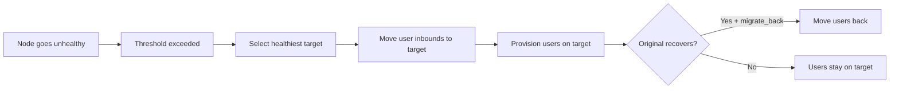

# 16. VortexUI v1.2.0 — Yeni Özellikler Rehberi

!!! info "Version 1.2.0"
    Bu sayfa VortexUI v1.2.0 ile tanıtılan tüm özellikleri belgelemektedir. Her bölüm özelliğin ne yaptığını, nasıl yapılandırılacağını ve yaygın kullanım senaryolarını açıklar.

---

## Canlı İzleme

**Konum:** Gösterge Paneli → Canlı İzleme

Tüm düğüm filonuzdaki aktif bağlantıların gerçek zamanlı görünümü.

### Gördükleriniz

| Metric | Açıklama |
|--------|-------------|
| Users Online | En az bir aktif bağlantısı olan benzersiz kullanıcılar |
| Connections | Tüm düğümler genelindeki toplam aktif tüneller |
| Unique IPs | Benzersiz istemci IP adresleri |
| Nodes Active | En az bir bağlantısı olan düğümler |

### Bağlantı tablosu

Her satır şunları gösterir:

- **User** — kullanıcı adı
- **Node** — bağlı olduğu sunucu
- **IP** — istemci kaynak IP adresi
- **Protocol** — VLESS, VMess, Trojan, vb.
- **Duration** — bağlantının ne kadar süredir aktif olduğu

!!! tip
    İzleyici her 3 saniyede bir sorgulama yapar. "No active connections" görüyorsanız, şu anda trafik tünelleyen kullanıcı yok demektir — yeni kurulumlar için bu normaldir.

---

## Analitik

**Konum:** Gösterge Paneli → Analitik

Ülke, kullanıcı ve günün saatine göre toplanmış trafik bilgileri.

### Zaman aralıkları

Açılır menüden **Last 24h**, **Last 7 days** veya **Last 30 days** seçin.

### Bölümler

| Section | Gösterdiği |
|---------|-------|
| Summary cards | Toplam yükleme, toplam indirme, ülke sayısı |
| Traffic by Country | Coğrafi dağılım — ülke, bağlantılar, yükleme/indirme baytları |
| Top Users | Toplam tüketilen trafiğe göre sıralı |
| Peak Hours | Saatlik trafik hacmi çubuk grafiği |

### Dışa aktarma

Seçilen aralık için coğrafi + kullanıcı verilerinin elektronik tablosunu indirmek üzere **Export CSV** düğmesine tıklayın.

!!! note
    Analitik verileri, düğüm aracıları tarafından doldurulan `traffic_geo` tablosundan gelir. Tablo boşsa, düğümlerinizin coğrafi veri raporladığından emin olun.

---

## CDN/Relay Zincirleri

**Konum:** Ağ ve Düğümler → CDN/Relay Zincirleri

Kullanıcı trafiğini düğüme ulaşmadan önce ara sunucular üzerinden yönlendirerek gerçek sunucu IP'nizi gizleyin.

### Atlama türleri

| Type | Açıklama | En uygun kullanım |
|------|-------------|----------|
| **CDN** | Trafik Cloudflare gibi bir CDN üzerinden geçer | Ücretsiz IP gizleme, WebSocket aktarım gerektirir |
| **Relay** | Trafik bir VPS aktarma sunucusu üzerinden yönlendirilir | CDN engellendiğinde veya TCP gerektiğinde |
| **Worker** | Cloudflare Workers'ı aktarıcı olarak kullanır | Sunucusuz, ekonomik, özel VPS gerektirmez |

### Zincir oluşturma

1. **New Chain** düğmesine tıklayın
2. Bir ad girin ve hedef düğümü seçin
3. Atlamaları sırayla ekleyin (trafik akışı: Kullanıcı → Atlama 1 → Atlama 2 → … → Düğüm)
4. Her atlama için yapılandırın:
   - **Type** (CDN / Relay / Worker)
   - **Address** ve **Port**
   - **Protocol** (WebSocket / gRPC / TCP)
   - **SNI** ve **Path** (TLS tabanlı aktarımlar için)

!!! example "Örnek: Cloudflare CDN aktarması"
    ```
    Hop 1: CDN — cdn.example.com:443 — WebSocket — SNI: cdn.example.com — Path: /ws
    Target: Your actual node
    ```
    Kullanıcılar Cloudflare'a bağlanır, o da düğümünüze yönlendirir. Gerçek IP'niz gizli kalır.

---

## Otomatik Taşıma

**Konum:** Ağ ve Düğümler → Otomatik Taşıma

Kullanıcıları sağlıksız düğümlerden sağlıklı olanlara otomatik olarak taşıyın.

### Politika ayarları

| Setting | Açıklama | Varsayılan |
|---------|-------------|---------|
| Enabled | Otomatik taşımayı aç/kapat | Off |
| Health check interval | Sağlık kontrolleri arası saniye | 30 |
| Unhealthy threshold | Tetikleme öncesi ardışık başarısızlıklar | 3 |
| CPU threshold | CPU bu yüzdeyi aşarsa taşı | 90 |
| Memory threshold | RAM bu yüzdeyi aşarsa taşı | 90 |
| Packet loss max | Paket kaybı bu yüzdeyi aşarsa taşı | 10 |
| Migrate back | Orijinal düğüm kurtulduğunda kullanıcıları geri getir | Yes |

### Nasıl çalışır



### Taşıma olayları

**Events** tablosu her taşımayı gösterir: zaman damgası, neden, durum (tamamlandı/başarısız) ve kaynak/hedef düğüm adları.

---

## Kaçınma Profilleri (DPI Atlatma)

**Konum:** Güvenlik → Kaçınma Profilleri

Önceden yapılandırılmış DPI karşıtı teknikler. Tek tıkla sansür atlatma için gelen bağlantılara profil atayın.

### Teknikler

| Technique | Nasıl çalışır | Etkili olduğu alan |
|-----------|-------------|-------------------|
| **Fragment** | TLS ClientHello'yu küçük paketlere böler | İran DPI, Rusya TSPU |
| **Mux** | Bağlantıları tek bir akışta çoğaltır | Trafik analizi |
| **Fingerprint** | Gerçek tarayıcı TLS'ini taklit eder (Chrome/Firefox/Safari) | Parmak izi tabanlı engelleme |

### Profil oluşturma

1. **New Profile** düğmesine tıklayın
2. Bir ad girin (örn. "Iran — Fragment + Chrome")
3. Yapılandırın:
   - **Fingerprint**: Chrome, Firefox, Safari, Random, Randomized
   - **Fragment**: Etkinleştir + uzunluk aralığı belirle (örn. `10-30`)
   - **Mux**: Etkinleştir + protokol seç (smux, yamux, h2mux)
4. Kaydet → Inbound ayarları üzerinden gelen bağlantılara ata

!!! tip "Ülke ön ayarları"
    - **İran**: Fragment `10-30` + Chrome parmak izi
    - **Çin**: Mux h2mux + Randomized parmak izi
    - **Rusya**: Fragment `1-3` + Firefox parmak izi

---

## Yoklama Koruması

**Konum:** Güvenlik → Yoklama Koruması

Sansürcülerden (Çin'in GFW'si gibi) gelen aktif yoklama girişimlerini tespit edin ve engelleyin.

### Aktif yoklama nedir?

Sansürcüler "yoklama" paketleri göndererek proxy'leri keşfeder. Sunucunuz bir proxy gibi yanıt verirse engellenir. Bu özellik bu yoklamaları yakalar.

### Eylemler

| Action | Davranış |
|--------|----------|
| **Block** | Bağlantıyı düşür ve IP'yi yapılandırılan süre boyunca yasakla |
| **Honeypot** | Yoklayıcıyı kandırmak için sahte bir web sitesi döndür (örn. nginx varsayılan sayfası) |
| **Log only** | Eylem almadan yoklamayı kaydet (izleme modu) |

### Yapılandırma

1. Korumayı etkinleştirin
2. **Action** ayarlayın (Block önerilir)
3. **Block duration** ayarlayın (varsayılan: 3600s = 1 saat)
4. **Max probes/min** ayarlayın (tetikleme eşiği — varsayılan: 5)
5. Güvenilir IP'leri **Whitelist**'e ekleyin (izleme, CI, vb.)
6. Uyarı almak için **Telegram notification** etkinleştirin

### Engellenen IP'ler

Şu anda engellenen IP'leri görüntüleyin ve gerektiğinde engeli manuel olarak kaldırın.

---

## İstemci Parmak İzi Doğrulama

**Konum:** Güvenlik → Fingerprint

TLS ClientHello parmak izine göre bağlantıları engelleyin.

### Nasıl çalışır

Her TLS istemcisi (tarayıcı, uygulama, tarayıcı aracı) ClientHello paketinde benzersiz bir parmak izi üretir. Bilinen tarayıcı araçları (curl, Go HTTP, Python requests), gerçek tarayıcılardan farklı ayırt edici parmak izlerine sahiptir.

### Politika

| Setting | Açıklama |
|---------|-------------|
| Enabled | Parmak izi kontrolünü etkinleştir |
| Default action | Bilinmeyen parmak izleri için ne yapılacağı: Allow / Block / Log |
| Log unknown | Tanınmayan parmak izlerinden gelen bağlantıları kaydet |

### Kurallar

Belirli parmak izlerini açıkça izin vermek/engellemek için kurallar oluşturun:

| Field | Açıklama |
|-------|-------------|
| Name | Okunabilir etiket (örn. "Allow Chrome") |
| Fingerprint | Tarayıcı/araç adı (chrome, firefox, safari, curl, go, python) |
| Action | Allow / Block / Log |
| JA3 Hash | İsteğe bağlı — hassas eşleştirme için tam JA3 hash değeri |

!!! example
    Tüm `curl` ve `python` parmak izlerini engelleyin (yaygın tarayıcı araçları):
    
    - Rule 1: fingerprint=curl, action=block
    - Rule 2: fingerprint=python, action=block

---

## DNS-over-HTTPS (DoH)

**Konum:** Güvenlik → DNS-over-HTTPS

Kullanıcılarınız için DNS sızıntılarını önleyen yerleşik DoH sunucusu.

### Ne yapar

- Şifreli bir DNS uç noktası sağlar (`/dns-query`)
- DNS seviyesinde reklamları ve kötü amaçlı yazılımları engeller
- Daha hızlı çözüm için yanıtları önbelleğe alır
- Hata ayıklama için sorguları kaydeder (isteğe bağlı)

### Yapılandırma

| Setting | Açıklama | Varsayılan |
|---------|-------------|---------|
| Enabled | DoH sunucusunu aç/kapat | Off |
| Listen address | Bağlanılacak IP:port | `:8053` |
| Upstream DNS | Yönlendirilecek çözümleyiciler | `1.1.1.1`, `8.8.8.8` |
| Block ads | Reklam alan adlarını filtrele | Off |
| Block malware | Kötü amaçlı yazılım alan adlarını filtrele | On |
| Custom blocklist | Kendi engellenen alan adlarınız | Empty |
| Log queries | Tüm DNS sorgularını kaydet | Off |
| Cache TTL | Yanıtları önbelleğe alma süresi (saniye) | 300 |

### İstatistikler

Gösterge paneli şunları gösterir:
- İşlenen toplam sorgu sayısı
- Engellenen sorgu sayısı
- Önbellek isabet oranı
- Ortalama çözüm gecikmesi

---

## SNI Yönlendirme ve SSL

**Konum:** Güvenlik → SNI & SSL

Otomatik SSL sertifika sağlama ile sunucunuzda birden fazla alan adını yönetin.

### Alan adları

Sunucunuza işaret eden alan adlarını kaydedin:

1. **Add Domain** düğmesine tıklayın
2. Gelen bağlantı kimliğini ve alan adını girin
3. Otomatik Let's Encrypt sertifikası için **Auto-provision SSL** etkinleştirin

### Sertifikalar

SSL sertifikalarını manuel olarak yönetin:

- **Issue Certificate** — yeni sertifika talep et (Let's Encrypt / ZeroSSL)
- **Wildcard** — `*.domain.com` için sertifika ver
- **Auto-renew** — süresi dolmadan otomatik yenile
- **Renew** — yenilemeyi manuel olarak tetikle

---

## Panel Federasyonu

**Konum:** Ağ ve Düğümler → Federation

Dağıtık yönetim için birden fazla VortexUI panelini birbirine bağlayın.

### Kullanım senaryoları

- Farklı bölgelerde panelleri olan büyük dağıtımlar
- Her bayinin kendi paneline sahip olduğu bayi yapıları
- Yüksek erişilebilirlik — bir panel çökerse diğerleri devam eder

### Yapılandırma

| Setting | Açıklama |
|---------|-------------|
| Enabled | Federasyonu etkinleştir |
| Cluster name | Bu küme için tanımlayıcı |
| Sync interval | Ne sıklıkta senkronize edilecek (saniye) |
| SSO | Paneller arası tek oturum açmayı etkinleştir |

### Eş ekleme

1. **Add Peer** düğmesine tıklayın
2. Eş panelin URL'sini girin (örn. `https://panel2.example.com`)
3. API anahtarını girin (eş panelde oluşturulan)
4. Neyin senkronize edileceğini seçin: Kullanıcılar, Düğümler veya her ikisi

### Senkronizasyon olayları

Eşler arasındaki senkronizasyon işlemlerinin geçmişini görüntüleyin.

---

## Aile Grupları

**Konum:** Kullanıcılar ve Faturalandırma → Aile Grupları

Kullanıcıların aile üyeleri arasında veri havuzunu paylaşmasına izin verin.

### Nasıl çalışır

1. Yönetici paylaşılan veri limiti olan bir **Aile Grubu** oluşturur
2. Üyeler eklenir (mevcut kullanıcılar)
3. Her üyenin trafiği paylaşılan havuzdan çekilir
4. Bireysel üye kotaları ayarlanabilir (isteğe bağlı)

### Alanlar

| Field | Açıklama |
|-------|-------------|
| Name | Grup adı |
| Owner | Birincil kullanıcı hesabı |
| Data limit | Toplam paylaşılan veri havuzu |
| Max members | Kaç kişi katılabilir (varsayılan: 5) |
| Member quota | Paylaşılan havuz içinde üye başına üst sınır |

---

## Yönlendirme Sistemi

**Konum:** Kullanıcılar ve Faturalandırma → Yönlendirmeler

Yeni müşteri getiren kullanıcıları ödüllendirin.

### Yönetici yapılandırması

| Setting | Açıklama | Varsayılan |
|---------|-------------|---------|
| Enabled | Yönlendirmeleri aç/kapat | Off |
| Reward type | `data` (ekstra trafik) veya `days` (ekstra süre) | data |
| Reward amount | Yönlendirme başına ne kadar ödül | 1 GB |
| Max referrals | Kullanıcı başına sınır (0 = sınırsız) | 0 |
| Require paid | Sadece ödeme yapan yönlendirmeler için ödül ver | Off |

### Kullanıcılar nasıl kullanır

1. Kullanıcı benzersiz bir yönlendirme kodu alır (Portal üzerinden)
2. Kodu arkadaşlarıyla paylaşır
3. Arkadaş kodu kullanarak kaydolur
4. Her ikisi de ödüllendirilir (yapılandırılabilir)

---

## Akıllı Kota

**Konum:** Kullanıcılar ve Faturalandırma → Akıllı Kota

Kademeli hız/davranış ile adil kullanım trafik politikaları.

### Örnek kademeler

```json
[
  { "threshold_pct": 80, "action": "warn", "speed_limit": 0 },
  { "threshold_pct": 95, "action": "throttle", "speed_limit": 524288 },
  { "threshold_pct": 100, "action": "disable" }
]
```

%80 kullanımda → uyar. %95'te → 512KB/s'ye kısıtla. %100'de → devre dışı bırak.

---

## Düğüm Hız Sınırı ve Coğrafi Engelleme

**Konum:** Düğümler → Düğüm Düzenle

### Hız sınırı

Kullanıcı başına indirme hızı üst sınırı ayarlayın (bayt/sn):

- `0` = sınırsız
- `1048576` = 1 MB/s
- `5242880` = 5 MB/s

### Coğrafi engelleme

Bu düğüme hangi ülkelerin bağlanabileceğini kısıtlayın:

- Boş = tüm ülkelere izin verilir
- `IR,TR,AE` = yalnızca İran, Türkiye, BAE'ye izin verilir
- ISO 3166-1 alpha-2 ülke kodları kullanılır

---

## Derin Bağlantılar ve QR Kodları

**Konum:** Sistem → Derin Bağlantılar

Kolay istemci uygulaması kurulumu için abonelik derin bağlantıları ve QR kodları oluşturun.

### Yapılandırma

| Setting | Açıklama |
|---------|-------------|
| Base URL | Panelin genel URL'si |
| App scheme | Yerel uygulamalar için URL şeması (örn. `vortex://`) |
| Include name | Bağlantıya sunucu adını ekle |
| QR logo | QR merkezinde özel logo |

---

## Self-Servis Portal

**Konum:** `/portal/login` (son kullanıcıya yönelik)

Son kullanıcıların aboneliklerini yönetmeleri için ayrı bir arayüz.

### Portal özellikleri

| Feature | Açıklama |
|---------|-------------|
| Dashboard | Kullanım istatistikleri, kalan veri/süre |
| Plans | Abonelik planlarını incele ve satın al |
| Tickets | Destek talebi aç, yöneticiye yanıt ver |
| Referral | Yönlendirme kodunu görüntüle/paylaş |

### Yönetici talep yönetimi

Yöneticiler tüm talepleri **Kullanıcılar ve Faturalandırma → Talepler** bölümünde görüntüleyebilir, yanıtlayabilir ve kapatabilir.

---

## Kota Bildirimleri

**Konum:** Kullanıcılar ve Faturalandırma → Kota Uyarıları

Kullanıcıları veri limitine yaklaştıklarında uyarın.

### Yapılandırma

| Setting | Açıklama |
|---------|-------------|
| Enabled | Bildirimleri etkinleştir |
| Threshold % | Ne zaman tetikleneceği (örn. %80) |
| Telegram | Telegram botu üzerinden gönder |
| Email | E-posta ile gönder (yapılandırılmışsa) |
| Message template | Özel bildirim metni |

---

## Sahte Web Sitesi

**Konum:** Güvenlik → Sahte Web Sitesi

Birisi sunucunuzun IP adresini doğrudan ziyaret ettiğinde (geçerli bir proxy bağlantısı olmadan) sahte bir web sitesi gösterin.

### Modlar

| Mode | Davranış |
|------|----------|
| **Proxy** | Mevcut bir web sitesini ters proxy ile sun (aynalar) |
| **Static** | Özel HTML sun |

Bu, sunucunuzu sansürcüler ve sıradan ziyaretçiler için normal bir web sitesi gibi gösterir.

---

## Reality Tarayıcı

**Konum:** Güvenlik → Reality Scanner

REALITY protokolü için en iyi SNI alan adlarını tarayarak ve puanlayarak bulun.

### Nasıl kullanılır

1. Bir düğüm seçin
2. **Scan** düğmesine tıklayın — yaygın alan adlarını TLS 1.3 uyumluluğu ve gecikme açısından test eder
3. Sonuçlar şunları gösterir: SNI, gecikme (ms), puan, geçerlilik
4. REALITY gelen bağlantınız için en yüksek puanlı alan adını seçin

!!! tip
    İyi REALITY SNI'leri genellikle şu özelliklere sahiptir: düşük gecikme (<200ms), TLS 1.3 desteği ve kararlı bağlantılar.
