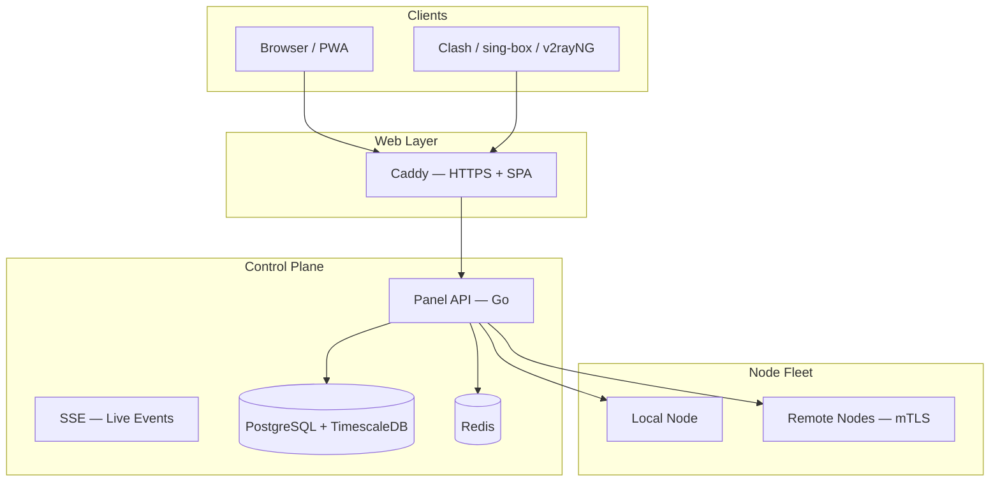

# VortexUI Dokümantasyon

Resmi VortexUI kılavuzuna hoş geldiniz.

Yeni nesil proxy panelini kurun ve yönetin (Xray + sing-box). **Dil seçiciyi** üst menüden kullanın.

!!! tip "Hızlı kurulum"
    ```bash
    bash <(curl -Ls https://raw.githubusercontent.com/iPmartNetwork/VortexUI/master/install.sh)
    ```

## Dokümantasyon haritası

| Bölüm | Bölümler |
|---------|----------|
| Başlangıç | [Giriş](01-introduction.md) · [Kurulum](02-installation.md) · [İlk adımlar](03-first-steps.md) |
| Panel rehberi | [Pano](04-dashboard.md) · [Kullanıcılar](05-user-management.md) · [Node'lar](06-node-management.md) · [Ağ](07-network-policy.md) |
| Yönetim | [Güvenlik](08-security-administration.md) · [Planlar](09-plans-payments.md) · [Bildirimler](10-notifications.md) · [Ayarlar](11-settings-backup.md) |
| Teknik referans | [API](12-api-reference.md) · [Protokoller](13-protocols-config.md) · [Operasyonlar](14-operations-maintenance.md) · [SSS](15-troubleshooting-faq.md) |
| Sürüm yenilikleri | [v1.2.5 Özellikleri](18-v125-features.md) · [v1.2.3 Özellikleri](17-v123-features.md) · [v1.2.0 Özellikleri](16-v120-features.md) |

## Mimari



## Faydalı bağlantılar

| Kaynak | Bağlantı |
|----------|------|
| OpenAPI | [openapi.yaml on GitHub](https://github.com/iPmartNetwork/VortexUI/blob/master/docs/openapi.yaml) |
| Protocol examples | [protocols.md](https://github.com/iPmartNetwork/VortexUI/blob/master/docs/protocols.md) |
| Repository | [github.com/iPmartNetwork/VortexUI](https://github.com/iPmartNetwork/VortexUI) |
| Telegram | [@vortex_ui](https://t.me/vortex_ui) |
