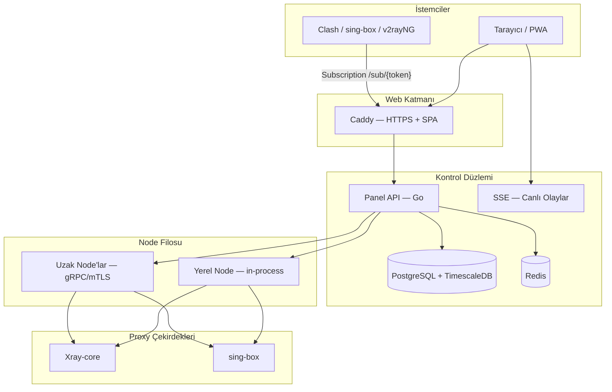

<div align="center" class="wiki-hero">


# 📚 VortexUI Wiki

**Yeni nesil proxy yönetim panelini kurma, yapılandırma ve işletme rehberi**

[](https://github.com/iPmartNetwork/VortexUI/releases)
[](../../../LICENSE)

[← Çok Dilli Wiki](./README.md) · [English](../en/README.md) · [فارسی](../fa/README.md) · [العربية](../ar/README.md) · [English README](../../../README.md) · [README فارسی](../../../README.fa.md)

</div>

---

## Bu Wiki Hakkında

Bu wiki, **VortexUI** için eksiksiz referans kaynağıdır — Go arka uç, React/TypeScript ön uç ve **Xray-core** ile **sing-box** desteğine sahip açık kaynaklı bir proxy yönetim paneli. Sunucu yöneticileri, VPN hizmet satıcıları ve API üzerinden entegrasyon yapan geliştiriciler için yazılmıştır.

### Mimari Genel Bakış



---

## 📖 İçindekiler

### Başlangıç

| # | Konu | Açıklama |
|:-:|-------|----------|
| 1 | [Giriş ve temel kavramlar](./01-introduction.md) | VortexUI nedir, mimari, diğer panellerle karşılaştırma |
| 2 | [Kurulum](./02-installation.md) | Tek satır kurulum, Docker, native, ön koşullar |
| 3 | [İlk adımlar](./03-first-steps.md) | Giriş, admin oluşturma, ilk inbound ve kullanıcı |

### Panel Rehberi

| # | Konu | Açıklama |
|:-:|-------|----------|
| 4 | [Gösterge paneli](./04-dashboard.md) | Canlı istatistikler, grafikler, SSE |
| 5 | [Kullanıcı yönetimi](./05-user-management.md) | Kullanıcı oluşturma, kota, abonelikler, içe aktarma |
| 6 | [Node yönetimi](./06-node-management.md) | Yerel/uzak node'lar, inbound, Geo, failover |
| 7 | [Ağ politikası](./07-network-policy.md) | Outbound'lar, yönlendirme, dengeleyiciler |
| 8 | [Güvenlik ve yönetim](./08-security-administration.md) | RBAC, 2FA, API token'ları, denetim |
| 9 | [Planlar ve ödemeler](./09-plans-payments.md) | Abonelik satışı, ZarinPal, NowPayments |
| 10 | [Bildirimler](./10-notifications.md) | Webhook'lar, Telegram, olaylar |
| 11 | [Ayarlar ve yedekleme](./11-settings-backup.md) | Yedekleme, markalama, IP Guard |

### Teknik Referans

| # | Konu | Açıklama |
|:-:|-------|----------|
| 12 | [API referansı](./12-api-reference.md) | Kimlik doğrulama, endpoint'ler, OpenAPI |
| 13 | [Protokoller ve yapılandırma](./13-protocols-config.md) | VLESS, REALITY, Hysteria2, örnekler |
| 14 | [İşletim ve bakım](./14-operations-maintenance.md) | `vortexui`, SSL, güncellemeler, metrikler |
| 15 | [Sorun giderme ve SSS](./15-troubleshooting-faq.md) | Yaygın sorunlar ve yanıtlar |

---

## ⚡ Hızlı Erişim

### Tek satır kurulum (önerilen)

```bash
bash <(curl -Ls https://raw.githubusercontent.com/iPmartNetwork/VortexUI/master/install.sh)
```

### Yönetim konsolu

```bash
vortexui          # etkileşimli menü
vortexui status   # servis durumu
vortexui logs     # log görüntüleme
vortexui update   # panel güncelleme
```

### Faydalı bağlantılar

| Kaynak | Yol |
|--------|-----|
| OpenAPI 3.0 | [`docs/openapi.yaml`](../../openapi.yaml) |
| Protokol örnekleri | [`docs/protocols.md`](../../protocols.md) |
| Ortam değişkenleri | [`.env.example`](../../../.env.example) |
| Docker Compose | [`deploy/compose.yml`](../../../deploy/compose.yml) |
| Changelog | [`CHANGELOG.md`](../../../CHANGELOG.md) |

---

## 🌐 Panel UI Dilleri

Panel **8 dili** destekler: English, فارسی, Türkçe, العربية, Русский, 中文, 日本語, Español — Farsça ve Arapça için tam **RTL** desteği ile.

Dil değiştirme: **Settings → Language** veya yan menüden.

---

## 📄 Lisans

VortexUI **GPL-3.0** altında yayınlanmıştır. Bkz. [LICENSE](../../../LICENSE).
