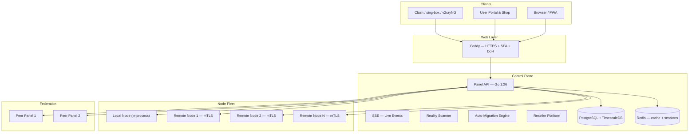

# VortexUI Belgelendirmesi

<div style="text-align: center; margin: 2rem 0;">
  <strong style="font-size: 1.4rem;">VortexUI v1.2.9</strong><br/>
  <em style="font-size: 1.1rem;">Yeni nesil proxy yönetim paneli — çekirdek-bağımsız, kullanıcı-merkezli, gerçek zamanlı, sansür karşıtı</em>
</div>

---

<div class="grid cards" markdown>

- :material-account-group: **Self-Servis Portal ve Mağaza**

    Son kullanıcılar abonelik tokenleri ile giriş yapar, kullanımlarını görüntüler, bayilerinin mağazasından plan satın alır ve destek talepleri oluşturur.

- :material-cash-register: **Bayi Bazlı Planlar ve Ödemeler**

    Her bayi kendi planlarını, fiyatlandırmasını ve ödeme yöntemlerini belirler — karttan karta, kripto veya ZarinPal ödeme geçidi.

- :material-shield-lock: **Sansür Karşıtı Araç Seti**

    TLS Hileleri, aktif problama koruması, parmak izi doğrulama, sahte web siteleri, DoH, WARP+, gizlenme profilleri.

- :material-server-network: **Akıllı Düğüm Filosu**

    Kayıt sihirbazı, otomatik göç, sağlık tanılama, mTLS, canlı izleme, Cloudflare DNS otomasyonu.

- :material-chart-areaspline: **Gelişmiş Analitik**

    Geo-IP dağılımı, en aktif kullanıcılar, yoğun saatler, dünya haritası ısı haritası, CSV dışa aktarma, gerçek zamanlı göstergeler.

- :material-sitemap: **Bayi Platformu**

    Cüzdan faturalandırma, alt bayiler, beyaz etiket markalama, webhooklar, politika limitleri, otomatik askıya alma, kapsamlı izin listeleri.

</div>

---

!!! tip "Hızlı Kurulum"
    ```bash
    bash <(curl -Ls https://raw.githubusercontent.com/iPmartNetwork/VortexUI/master/install.sh)
    ```
    Tek komut. Etkileşimli kurulum. HTTPS dahil.

---

## Belgelendirme Haritası

| Bölüm | Öğrenecekleriniz |
|--------|------------------|
| [Giriş](01-introduction.md) | Mimari, özellik genel bakışı, karşılaştırma, desteklenen protokoller |
| [Kurulum](02-installation.md) | Tek satır kurulum, Docker, yerel derleme, düğüm ajanı kurulumu |
| [İlk Adımlar](03-first-steps.md) | Giriş, düğüm ekleme, gelen bağlantı oluşturma, kullanıcı ekleme, doğrulama |
| [Gösterge Paneli](04-dashboard.md) | Widget'lar, analitik, monitör, komut paleti |
| [Kullanıcılar](05-user-management.md) | CRUD, kotalar, abonelikler, portal, mağaza, aileler, referanslar |
| [Düğümler](06-node-management.md) | Kayıt, sağlık, otomatik göç, izleme, DNS otomasyonu |
| [Ağ](07-network-policy.md) | Giden bağlantılar, yönlendirme paketleri, CDN zincirleri, yük dengeleyiciler, federasyon |
| [Güvenlik](08-security-administration.md) | RBAC, bayi platformu, TLS hileleri, problama koruması, IP limiti |
| [Planlar ve Ödemeler](09-plans-payments.md) | Bayi bazlı planlar, ödeme yapılandırması, mağaza, cüzdan faturalandırma, siparişler |
| [Bildirimler](10-notifications.md) | Webhooklar, Telegram, kota uyarıları, SSE olayları |
| [Ayarlar](11-settings-backup.md) | Markalama, beyaz etiket, yedekleme, derin bağlantılar, güncellemeler |
| [API Referansı](12-api-reference.md) | Kimlik doğrulama, uç noktalar, OpenAPI spesifikasyonu |
| [Protokoller](13-protocols-config.md) | 14 protokol, taşımalar, güvenlik katmanları, yetenek matrisi |
| [Operasyonlar](14-operations-maintenance.md) | HTTPS, Prometheus, ölçekleme, veritabanı, performans |
| [Sorun Giderme](15-troubleshooting-faq.md) | Yaygın sorunlar, hata ayıklama ipuçları, SSS |

---

## Mimari



---

## Teknoloji Yığını

| Katman | Teknoloji |
|--------|-----------|
| Backend | Go 1.26, Echo, gRPC, sqlc, pgx |
| Frontend | React 18, TypeScript 5.6, Tailwind CSS, TanStack Query |
| Veritabanı | PostgreSQL 16 + TimescaleDB |
| Önbellek | Redis 7 |
| Proxy Çekirdekleri | Xray-core, sing-box |
| Web Sunucusu | Caddy (otomatik HTTPS) |
| İletişim | gRPC + mTLS (panel ↔ düğümler) |
| Bildirimler | Webhook (HMAC-SHA256), Telegram Bot API |
| İzleme | Prometheus metrikleri + Grafana |

---

## Hızlı Bağlantılar

| Kaynak | Bağlantı |
|--------|----------|
| GitHub Deposu | [github.com/iPmartNetwork/VortexUI](https://github.com/iPmartNetwork/VortexUI) |
| Telegram Kanalı | [@vortex_ui](https://t.me/vortex_ui) |
| OpenAPI Spesifikasyonu | [openapi.yaml](https://github.com/iPmartNetwork/VortexUI/blob/master/docs/openapi.yaml) |
| Değişiklik Günlüğü | [CHANGELOG.md](https://github.com/iPmartNetwork/VortexUI/blob/master/CHANGELOG.md) |
| Hata Raporları | [GitHub Issues](https://github.com/iPmartNetwork/VortexUI/issues) |
| Tartışmalar | [GitHub Discussions](https://github.com/iPmartNetwork/VortexUI/discussions) |

---

!!! info "Diller"
    Bu belgelendirme **English**, **فارسی**, **العربية** ve **Türkçe** dillerinde mevcuttur.
    Geçiş yapmak için başlıktaki dil seçiciyi kullanın.
